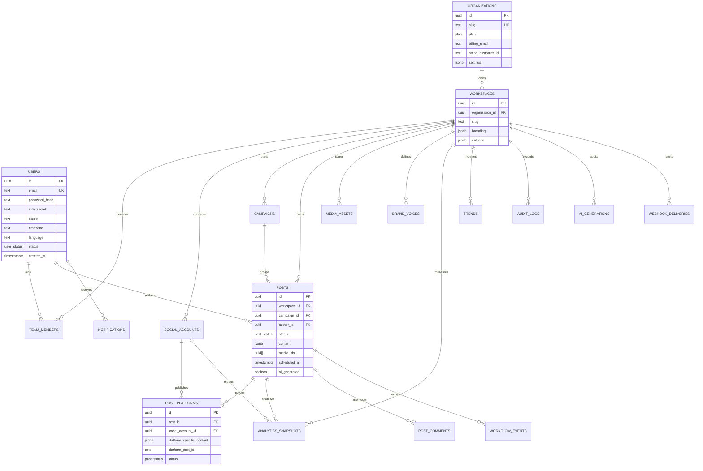

# Entity Relationship Diagram

## Index Strategy

- Unique lower-case email index on `users`.
- Unique organization slug and workspace slug per organization.
- Composite workspace/status and workspace/scheduled indexes on posts.
- Composite account/status index on platform targets.
- GIN indexes for post content and analytics metrics.
- Audit and AI generation indexes by workspace and created timestamp.

## Retention Strategy

- Audit logs: 7 years, monthly partitions before production cutover.
- AI generation logs: 90 days unless compliance plan requires longer.
- Analytics snapshots: 2 years hot query storage, then warehouse/archive.
- Media assets: until workspace deletion or explicit user deletion.
