# System Architecture

## First Deployable Shape

The initial implementation is a modular TypeScript monorepo:

- `apps/web`: Next.js App Router dashboard.
- `apps/api`: NestJS API with module boundaries matching future services.
- `packages/domain`: shared schemas, constants, permissions, and fixtures.
- `packages/database`: Drizzle schema and PostgreSQL migration.
- `infra`: Docker, Kubernetes, Terraform, monitoring, and CI assets.

The API starts as a modular monolith to reduce delivery risk. Modules can be extracted behind the same OpenAPI and event contracts as load and team ownership grow.

## Target Service Topology

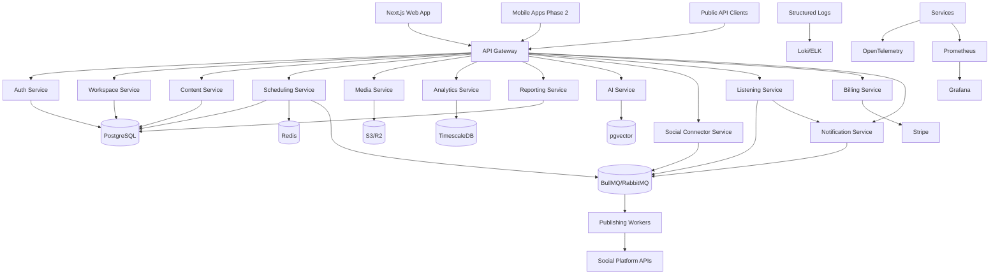

## Data Flow: AI-Assisted Scheduled Post

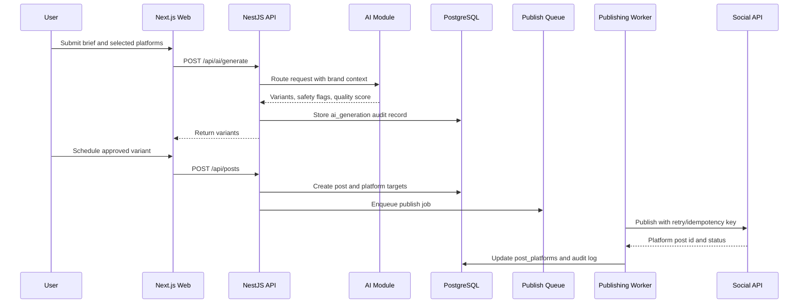

## Campaign Operations

Campaigns are treated as the planning aggregate for launch work. Each campaign can own milestones, tasks, budget lines, generated reports, and posts. The Campaigns module computes operational summaries from those resources so the Calendar view can show schedule risk, budget pacing, blocked tasks, and report readiness without waiting for a separate reporting warehouse.

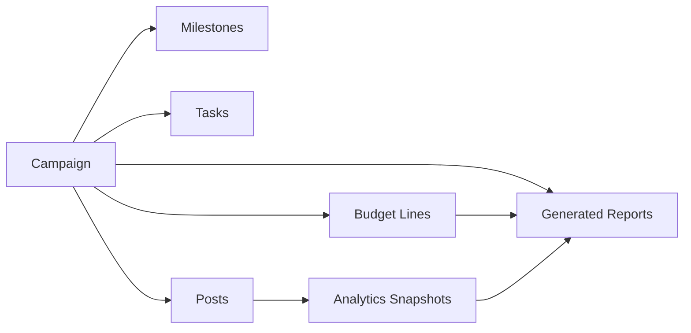

## Content Templates

Content templates make approved campaign structures reusable. Each template stores category, target platforms, body placeholders, default hashtags, governance guidance, usage count, and last-used metadata. The Content module renders variables into platform-specific post variants and creates the resulting draft or scheduled post through the existing Posts service so plan limits and platform character validation still apply.

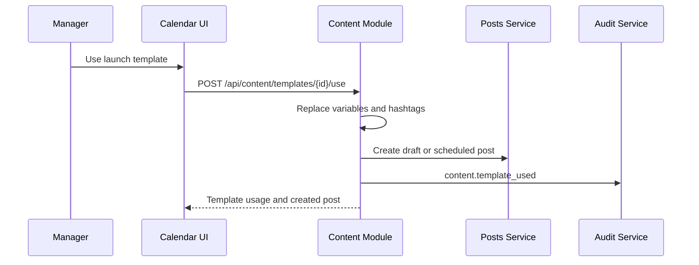

## Smart Scheduling

Smart scheduling rules describe platform windows, timezone, minimum gap, and daily post caps. Recommendation requests score future slots using the rule window plus recent platform analytics. Reserving a slot can update a post to `scheduled`, set its scheduled timestamp, and enqueue publishing jobs through the existing idempotent publishing service.

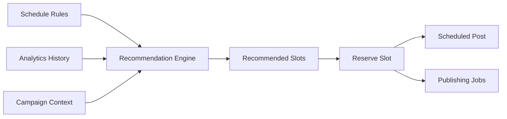

## Reporting, Exports, And Share Links

The Reports module turns analytics, listening, campaign, and executive data into reusable report templates. A template defines type, output format, filters, and branding; scheduled reports bind templates to recipients and next-run metadata; exports materialize a ready payload and download URL; share links expose an export through a scoped token with expiry and revocation state.

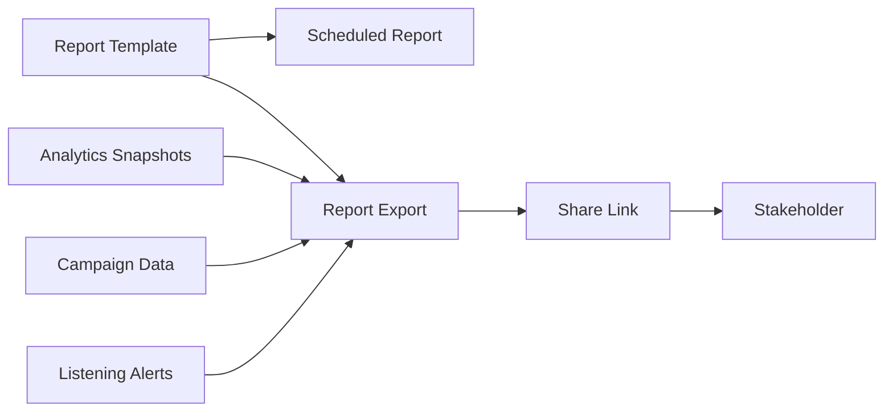

Report creation and share-link creation are gated by `analytics.export`; list/read routes require `analytics.view`. Production workers should replace the local synchronous export builder with background rendering, object storage, token hashing, and delivery retries while preserving the same API contract.

## Publishing Job Lifecycle

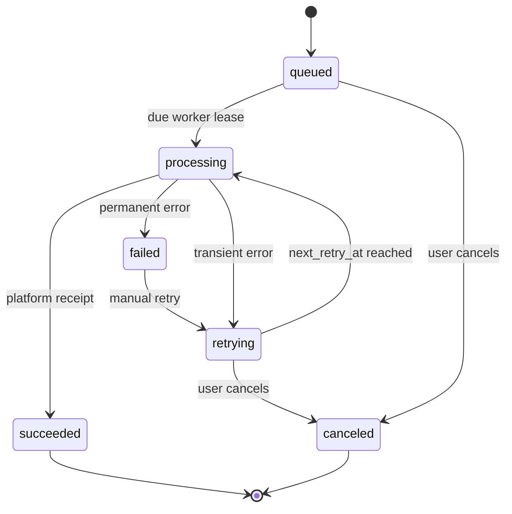

Every publishing job stores a unique idempotency key derived from post id, social account id, platform, and scheduled time. Workers must use this key for deduplication and platform correlation.

## Social Connector Lifecycle

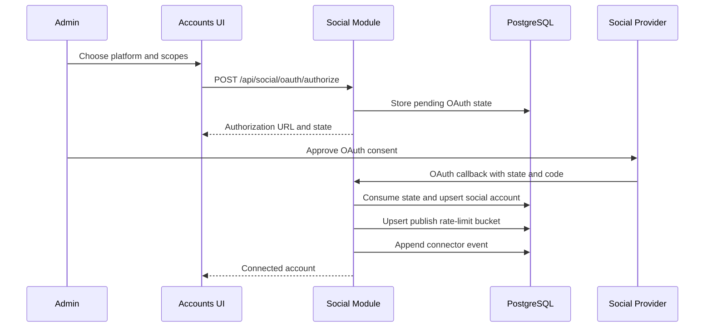

Connector events record OAuth, token refresh, scope validation, and account-health transitions. Publishing workers should consult account status and rate-limit buckets before dispatching provider calls.

## Social Listening And Alerting

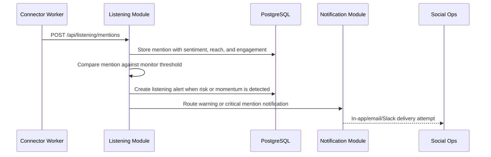

Listening monitors define brand, keyword, hashtag, competitor, or influencer queries per workspace. Mentions are stored with platform, author, sentiment, reach, engagement, and metadata. Warning and critical alerts are auditable, resolvable, and routed through the notification preference engine.

## Audit Event Backbone

Sensitive modules emit audit records through a shared audit service before the storage layer is swapped to Drizzle repositories. Covered actions include authentication success/failure, SSO connection changes, session and device revocation, content template creation/use, schedule rule and slot operations, report template/schedule/export/share-link operations, campaign task/budget/report operations, AI safety policy/check/moderation operations, workflow transitions, social connector lifecycle operations, listening monitor and alert operations, media upload/processing changes, publishing job state changes, and webhook replay. Records include actor, workspace, action, entity, old/new values, IP, user agent, and timestamp where available.

## Team Access And Service Credentials

Admins manage human access through workspace invitations and role updates. Invitation tokens are stored only as hashes, expire by default, and every create/resend/revoke action emits audit records. API keys are scoped service credentials: the raw secret is returned once on creation, only a prefix and hash are stored, and revocation is auditable.

API requests may authenticate with `x-api-key`. A global guard verifies the secret hash, rejects revoked/expired keys, updates last-used metadata, and creates an `api_service_account` principal whose permissions are limited to the key's stored scopes before the RBAC guard runs.

## Enterprise Identity Controls

Identity controls live beside team access because they protect the same workspace boundary. SSO connections store provider type, verified domain, entity id, SSO URL, certificate fingerprint, metadata, status, and last-tested timestamp. Sessions store user, status, device, IP, user agent, expiry, and revocation time. Trusted devices store fingerprint, owner, trust state, and last-seen metadata.

Admins can create, test, activate, and disable SSO connections; revoke individual sessions; trust pending devices; and revoke devices. Revoking a trusted device also revokes active sessions tied to that device. All mutations require `workspace.manage` and emit `identity.*` audit records for incident response.

## Entitlement Enforcement

The billing module exposes a centralized entitlement check used by capacity-consuming workflows. Current enforcement covers member invitations, API key creation, social OAuth starts, AI generation, media upload intents, and post creation. Checks project the requested increment against the workspace plan before the mutation proceeds.

## Notification Routing

Notifications are created once and routed into delivery attempts per enabled channel. Preferences store channel opt-ins, digest mode, muted event types, and quiet-hour windows. The local router deterministically records sent or suppressed attempts for in-app, email, push, Slack, Teams, SMS, and webhook channels so later workers can replace the simulated providers without changing API contracts.

## Brand Voice Engine

Brand voice profiles store tone, style, vocabulary controls, emoji strategy, CTA preferences, examples, and versions per workspace. AI generation can reference a profile to shape deterministic variants and surface banned-term findings as safety flags. The brand voice API also evaluates arbitrary copy so reviewers can check fit before publishing.

## AI Safety And Moderation

AI generation routes every brief through the Safety module before returning variants. Safety policies define blocked terms, required disclosure guidance, industry context, and maximum risk score per workspace. Checks persist flags, recommendations, severity, and risk score. Blocked drafts create moderation queue items so reviewers can approve, reject, or resolve them with audit evidence.

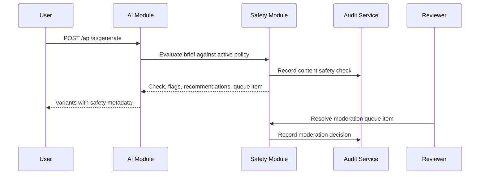

## Media Processing Pipeline

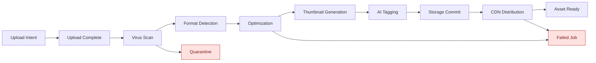

## Tenancy Model

- Organization owns billing and one or more workspaces.
- Workspace is the primary tenant boundary for content, templates, schedule rules, schedule slots, accounts, media, analytics, reports, identity controls, trends, listening monitors, social mentions, alerts, notifications, AI generations, webhooks, and audit logs.
- API authorizes every request against role permissions.
- PostgreSQL RLS uses `app.workspace_id` for database-layer isolation in production.

## Service Extraction Order

1. Publishing workers and scheduling queue.
2. Social connector service.
3. Media processing service.
4. Analytics and listening ingestion/query service.
5. AI model router service.
6. Billing and webhook service.
