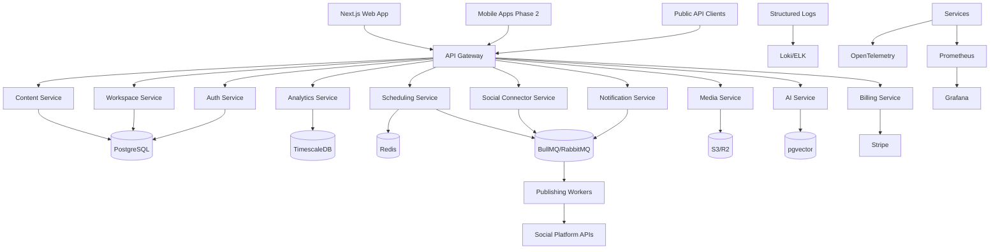
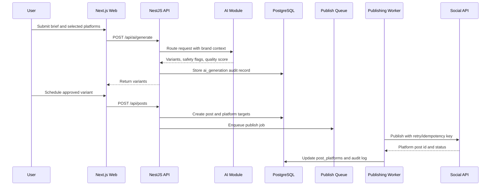
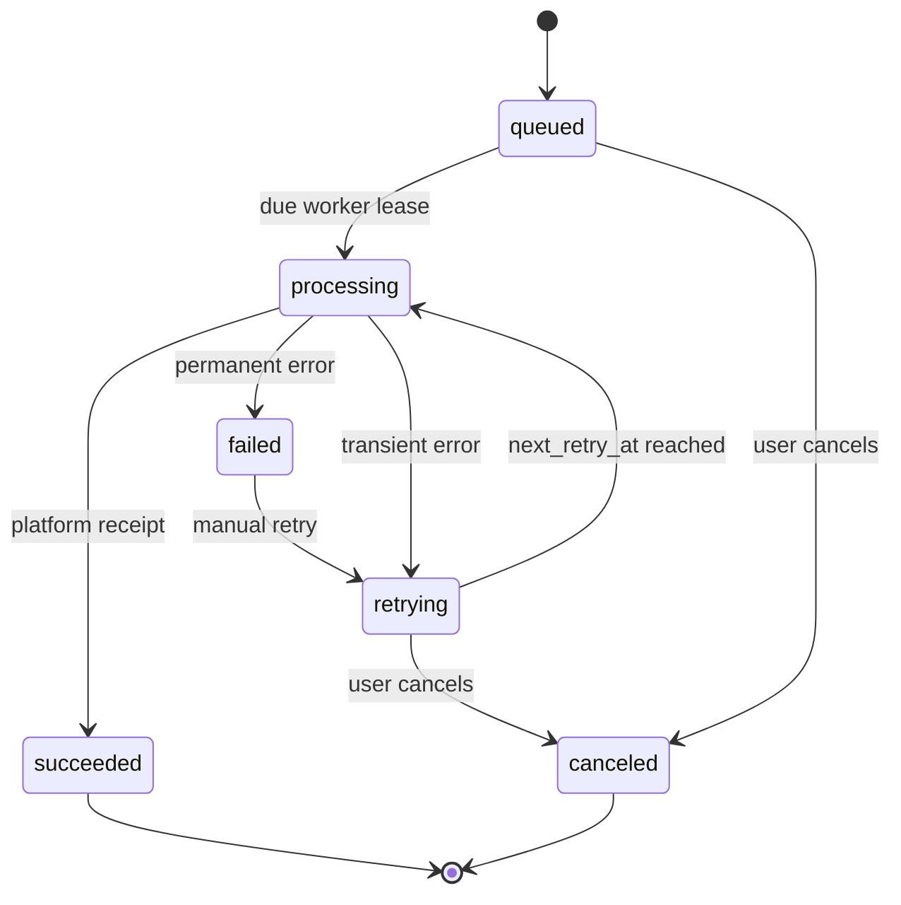
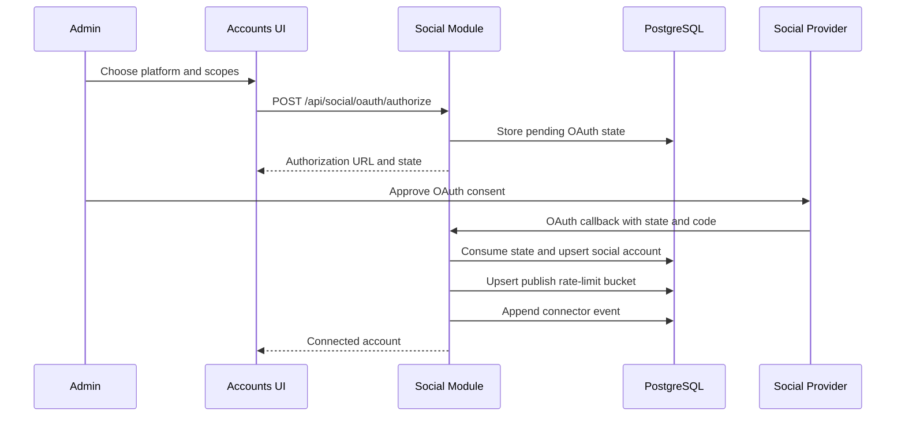
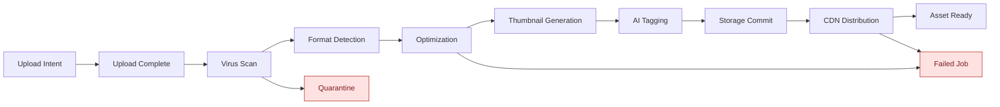

# System Architecture

## First Deployable Shape

The initial implementation is a modular TypeScript monorepo:

- `apps/web`: Next.js App Router dashboard.
- `apps/api`: NestJS API with module boundaries matching future services.
- `packages/domain`: shared schemas, constants, permissions, and fixtures.
- `packages/database`: Drizzle schema and PostgreSQL migration.
- `infra`: Docker, Kubernetes, Terraform, monitoring, and CI assets.

The API starts as a modular monolith to reduce delivery risk. Modules can be extracted behind the same OpenAPI and event contracts as load and team ownership grow.

## Target Service Topology

## Data Flow: AI-Assisted Scheduled Post

## Publishing Job Lifecycle

Every publishing job stores a unique idempotency key derived from post id, social account id, platform, and scheduled time. Workers must use this key for deduplication and platform correlation.

## Social Connector Lifecycle

Connector events record OAuth, token refresh, scope validation, and account-health transitions. Publishing workers should consult account status and rate-limit buckets before dispatching provider calls.

## Audit Event Backbone

Sensitive modules emit audit records through a shared audit service before the storage layer is swapped to Drizzle repositories. Covered actions include authentication success/failure, workflow transitions, social connector lifecycle operations, media upload/processing changes, publishing job state changes, and webhook replay. Records include actor, workspace, action, entity, old/new values, IP, user agent, and timestamp where available.

## Team Access And Service Credentials

Admins manage human access through workspace invitations and role updates. Invitation tokens are stored only as hashes, expire by default, and every create/resend/revoke action emits audit records. API keys are scoped service credentials: the raw secret is returned once on creation, only a prefix and hash are stored, and revocation is auditable.

API requests may authenticate with `x-api-key`. A global guard verifies the secret hash, rejects revoked/expired keys, updates last-used metadata, and creates an `api_service_account` principal whose permissions are limited to the key's stored scopes before the RBAC guard runs.

## Entitlement Enforcement

The billing module exposes a centralized entitlement check used by capacity-consuming workflows. Current enforcement covers member invitations, API key creation, social OAuth starts, AI generation, media upload intents, and post creation. Checks project the requested increment against the workspace plan before the mutation proceeds.

## Notification Routing

Notifications are created once and routed into delivery attempts per enabled channel. Preferences store channel opt-ins, digest mode, muted event types, and quiet-hour windows. The local router deterministically records sent or suppressed attempts for in-app, email, push, Slack, Teams, SMS, and webhook channels so later workers can replace the simulated providers without changing API contracts.

## Media Processing Pipeline

## Tenancy Model

- Organization owns billing and one or more workspaces.
- Workspace is the primary tenant boundary for content, accounts, media, analytics, trends, notifications, AI generations, webhooks, and audit logs.
- API authorizes every request against role permissions.
- PostgreSQL RLS uses `app.workspace_id` for database-layer isolation in production.

## Service Extraction Order

1. Publishing workers and scheduling queue.
2. Social connector service.
3. Media processing service.
4. Analytics ingestion/query service.
5. AI model router service.
6. Billing and webhook service.
