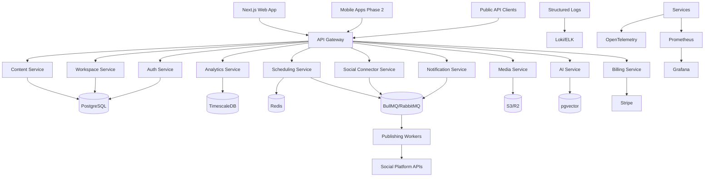
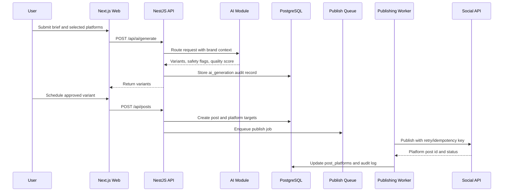

# System Architecture

## First Deployable Shape

The initial implementation is a modular TypeScript monorepo:

- `apps/web`: Next.js App Router dashboard.
- `apps/api`: NestJS API with module boundaries matching future services.
- `packages/domain`: shared schemas, constants, permissions, and fixtures.
- `packages/database`: Drizzle schema and PostgreSQL migration.
- `infra`: Docker, Kubernetes, Terraform, monitoring, and CI assets.

The API starts as a modular monolith to reduce delivery risk. Modules can be extracted behind the same OpenAPI and event contracts as load and team ownership grow.

## Target Service Topology

## Data Flow: AI-Assisted Scheduled Post

## Tenancy Model

- Organization owns billing and one or more workspaces.
- Workspace is the primary tenant boundary for content, accounts, media, analytics, trends, notifications, AI generations, webhooks, and audit logs.
- API authorizes every request against role permissions.
- PostgreSQL RLS uses `app.workspace_id` for database-layer isolation in production.

## Service Extraction Order

1. Publishing workers and scheduling queue.
2. Social connector service.
3. Media processing service.
4. Analytics ingestion/query service.
5. AI model router service.
6. Billing and webhook service.
